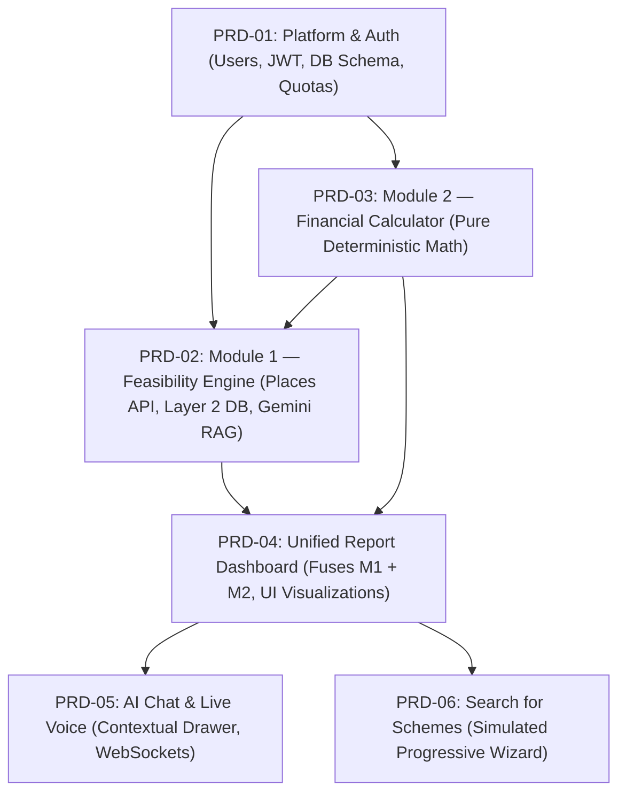

# VyapaarSathi (SIH 26091) — Product Requirement Documents (PRDs)

This directory contains the developer-ready, traceable Product Requirement Documents (PRDs) for the **VyapaarSathi** platform, developed for the Ministry of Social Justice and Empowerment (MoSJE) under Smart India Hackathon Problem Statement 26091.

Every requirement in these documents is traceable to the source project mandates, architectural vision, user journey maps, data dictionaries, and technical stack constraints in the `Docs/` directory.

---

## 📑 Module Index & Summaries

| Document | Title | One-Line Summary |
|---|---|---|
| [**PRD-01**](PRD-01-platform-auth.md) | **Platform & Auth** | Manages Google OAuth 2.0 and local auth, 1-hour JWT sessions, profile language preferences, past assessment history, and daily Vertex AI quota tracking. |
| [**PRD-02**](PRD-02-module1-feasibility.md) | **Module 1 — Hyper-Local Feasibility Report** | Synthesizes live Google Places data (Layer 1) with Tamil Nadu static census/economic data (Layer 2) via Vertex AI Gemini 2.5 Flash to generate a 6-point strategic feasibility report with source citations. |
| [**PRD-03**](PRD-03-module2-financial-calculator.md) | **Module 2 — Financial Calculator & Scheme Router** | Deterministically computes project cost, auto-routes to Micro Finance (6.5%) or Term Loan (8.0%), generates quarterly reducing-balance schedules with moratoriums, and evaluates FOIR affordability. |
| [**PRD-04**](PRD-04-unified-dashboard.md) | **Unified Report Dashboard** | Integrates M1 and M2 into a mobile-first, 4-tab dashboard featuring 3-KPI cards, break-even curve graph, Apple Activity Ring affordability verdict (🟢🟡🔴), competitor map, and PDF export. |
| [**PRD-05**](PRD-05-chat-voice-assistant.md) | **AI Chat & Live Voice Assistant** | Provides a contextual bottom chat drawer (Gemini 2.5 Flash) and bidirectional live voice toggle (Gemini Live 2.5 Flash Native Audio via WebSockets) with full transcript persistence. |
| [**PRD-06**](PRD-06-search-for-schemes.md) | **Search for Schemes (Simulated)** | Guides households through a progressive 3-step questionnaire to generate illustrative scheme matches grounded in static archetypes with strict non-misleading disclosures. |

---

## 🏗️ Recommended Implementation & Build Order

The modules should be developed and integrated in the following sequence based on their architectural dependencies:

### 1. Phase 1: Foundation & Data Architecture
1. **Implement PRD-01 (Platform & Auth):**
   - Setup Cloud SQL schema (`users`, `assessments`, `chat_messages`, `scheme_search_sessions`, `llm_usage_log`).
   - Configure Spring Security Google OAuth 2.0, local registration, JWT filter (1-hour expiration), and base `/settings` endpoints.

### 2. Phase 2: Core Computational & Analytical Engines
2. **Implement PRD-03 (Module 2 — Financial Calculator):**
   - *Why first:* Completely deterministic with zero external network or AI dependencies.
   - Implement exact scheme rules (Micro Finance $\le ₹1.4\text{L}$, Term Loan $₹1.4\text{L} - ₹50\text{L}$), reducing-balance quarterly amortization formula, moratorium offsets, and boundary assertions.
3. **Implement PRD-02 (Module 1 — Hyper-Local Feasibility):**
   - Mount SQLite `layer2_demand_economics.db` lookup.
   - Integrate Google Maps Geocoding, Places Aggregate, and Places API (New).
   - Implement Vertex AI `gemini-2.5-flash` prompt with strict source tagging and the sparse-data population ratio fallback.
   - Connect M1 pricing/revenue output into PRD-03's FOIR and break-even bridge.

### 3. Phase 3: Primary User Experience & Visual Synthesis
4. **Implement PRD-04 (Unified Report Dashboard):**
   - Build the 4-tab interface on `/report` using UX4G Aqua Blue design tokens.
   - Implement the 3-KPI cards, interactive what-if capital slider, Recharts break-even curve, Apple Activity Ring readiness and FOIR verdict component, Leaflet competitor map, and client-side PDF export.

### 4. Phase 4: Conversational & Value-Add Capabilities
5. **Implement PRD-05 (AI Chat & Live Voice Assistant):**
   - Embed the bottom chat drawer in `/report` injecting `module1_report_json` and `module2_result_json` into the Vertex AI prompt context.
   - Implement WebSocket audio pipeline for Gemini Live Native Audio with transcript persistence.
6. **Implement PRD-06 (Search for Schemes — Simulated):**
   - Build the progressive 3-step household questionnaire modal on Tab 4.
   - Ingest static mock archetype catalog (`mock_scheme_archetypes.json`), wire Vertex AI prompt, and enforce mandatory `is_illustrative: true` and disclaimer badges.
